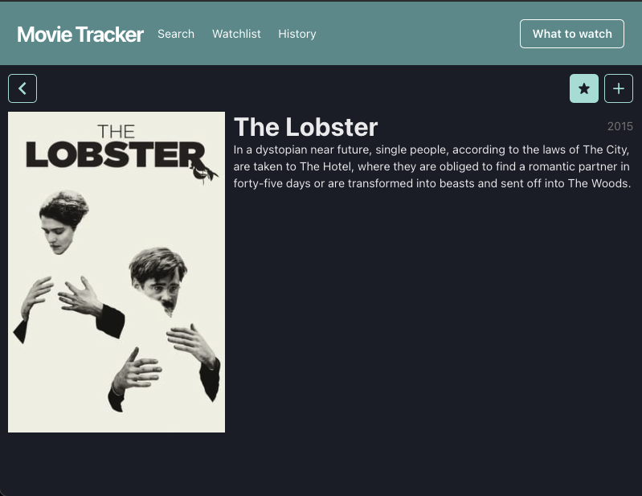
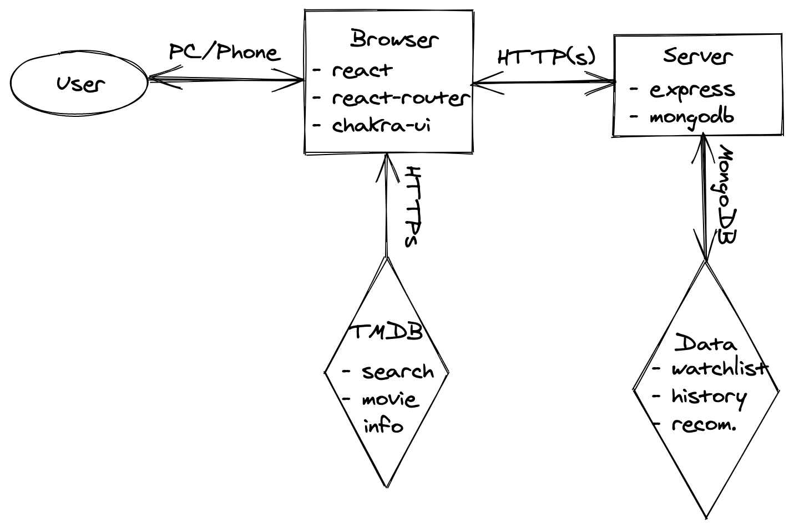

# Movie tracker



## Primii pași

1. Fork la acest repo
2. `git clone` la forkul nou creat (nu acest repo)
3. `npm install --legacy-peer-deps` pentru a descărca toate dependențele necesare
4. Creează un branch nou `quest` din `main` și lucrează pe el.
5. Oferă-mi access la fork, de pe GitHub `settings/access`, invită un colaborator, caută
   `victor@locoman.ro`.

## Rularea proiectului

1. într-un terminal `npm run server` - va porni serverul
2. în alt terminal `npm start` - va porni UI-ul

_! atenție, e important să rămână ambele terminale deschise pentru a rula aplicația corespunzător.
Modifică ceva din `/server/index.js` și ceva din `/src/index.js`. Verifică dacă apar modificările!_

3. Se va deschide automat un tab cu `localhost:3000` cu aplicația. Ar trebui să vezi mesajul "Up and
   running!"
4. Dacă ai întâmpinat probleme până aici, cere ajutor pe chat. Dacă nu, urmează partea interesantă
   🤩

## Tehnologii folosite

### [express](https://expressjs.com/en/4x/api.html)

Se ocupă de server, ne permite să definim rutele.

### [nodemon](https://nodemon.io/)

Reîncarcă serverul când modificăm fișierele lui.

### [mongodb](https://docs.mongodb.com/drivers/node/usage-examples)

O bază de date populară. Vedeți Rush 10.

### [react](https://reactjs.org/docs/hello-world.html)

Se ocupă de UI. Noi scriem componente care depind de `state`. React are grijă să afișeze în DOM
componentele noastre în dependență de `state`. Matematic vorbind:

```
UI = React(state)
```

Folosim [🪝hooks](https://reactjs.org/docs/hooks-intro.html) pentru cod frumos.

### [create-react-app](https://create-react-app.dev/docs/documentation-intro)

Pentru a face React corect, avem nevoie de mai multe instrumente, care îngreunează mult folosirea
React-ului. Din fericire, avem acest instrument care are grijă să configureze toate acele
instrumente și ne lasă pe noi să facem partea frumoasă.

### [react-router](https://reactrouter.com/web/guides/quick-start)

La fel cum express se ocupă de rutare pe server, acest instrument se ocupă de rutare în UI. Mai
întâi definim rutele existente prin `Route`, apoi înlocuim `anchor` tag cu `Link` component și de
restul se ocupă instrumentul.

### [chakra-ui](https://chakra-ui.com/docs/principles)

Ne permite să scriem CSS fără să scriem CSS 🤩. Și mai are și multe componente gata făcute. Nu e
nevoie să-l folosiți pentru a scrie cod, CSS-ul poate fi folosit în continuare. Dar, există opțiunea
să o faceți mai simplu, diferit.

### [TMDB](https://developers.themoviedb.org/3/search/search-movies)

The Movie Database oferă un API puternic, bogat în funcționalități. De la ei vom lua filmele și tot
ce ne interesează despre filme.

### Q: E necesar să folosesc toate aceste instrumente?

A: Nu e necesar, sunt doar alegerea mea. Te invit să înlocuiești oricare din ele după bun plac. E un
exercițiu bun să faci același proiect cu tehnologii diferite.

## Arhitectura aplicației

### Problema

Utilizatorul dorește să privească un film și are nevoie de ajutor să aleagă filmul potrivit.

### Soluția

Ii oferim o aplicație prin care să poată salva filmele favorite și filmele privite. Pe baza acestor
informații vom oferi recomandări.

Vom face o aplicație web unde utilizatorul va putea căuta filmele preferate, și apoi le poate salva
în favorite/istoric. Informațiile despre filme va fi luată de pe TMDB prin API-ul lor. Stocarea
informațiilor se va face în baza noastră de date, care o vom putea accesa printr-un server.
Recomandările le vom face pe baza informațiilor din BD.



## Structura proiectului

- `public`
  - `index.html` - De aici se va încărca aplicația în browser
- `server`
  - `index.js` - aici pornește serverul
  - `db.js` - ne conectăm la MongoDB
  - `api.js` - configurăm rutele de pe server
  - `utils.js` - aici ținem funcțiile reutilizabile pentru server
- `src` - UI/client
  - `index.js` - aici pornește UI-ul
  - `theme.js` - tema pentru chakra-ui
  - `utils.js` - funcții reutilizabile pe client
  - `pages` - o pagină are o rută prin care poate fi accesată
    - `Home.js` - prima pagină, câte puțin de toate (caută rapid un film, vezi câteva din listele
      tale, vezi recomandările)
    - `Search.js` - o căutare simplă pe TMDB
    - `Watchlist.js` - filmele favorite pe care utilizatorul dorește să le privească
    - `History.js` - filmele privite
    - `Recommendations.js` - aici utilizatorul va primi recomandări la ce film să privească acum
    - `Movie.js` - Pagina unui film, de aici se adaugă un film la favorite/istoric
  - `components` - componente de React care nu sunt pagini
    - `App.js` - structura aplicației = Header + pagina curentă, de care se ocupă routerul
    - `Header.js` - Bara de sus din pagină, cu meniu
    - `WatchlistButton.js` - Un buton folosit în `pages/Movie.js`
  - `connectors` - informații despre API-urile consumate
    - `api.js` - serverul nostru cu rutele lui și alte info ce țin de el
    - `tmdb.js` - serverul TMDB, inclusiv rutele și API key-ul
  - `hooks` - custom hooks, pentru logică reutilizabilă
    - `useFetchEffect.js` - pentru fetch la mount, l-am făcut împreună la un Rush
    - `useFetchCallback.js` - pentru fetch la apelul unei funcții
    - `useMovie.js` - logica de încărcare și actualizare a unui film, folosită în `pages/Movie.js`

## Sarcini

Acum să trecem la muncă. Am pregătit o listă cu sarcini, pentru fiecare sarcină realizată, primești
un punct. Cu 5 puncte primești badge, cu 10 deja ai punctaj maxim. cu 10+ vei fi lăudat de mentor,
mândru de realizarea ta.

1. ~~Deschide `README.md` în VS Code. O să verzi sursa textului în format Markdown. E chiar simpatic,
   dar dacă vrei să-l vezi ca și pe GitHub, apasă `Preview` din bara de sus. Acum, după ce ai
   completat un task, ✂️ îl tai de aici. Incepe cu acesta.~~

   ~~Apoi modifică datele de conectare (user, pass, url) la MongoDB în `server/db.js -> CONFIG`. E
   important ca să evităm conflictele. Cel puțin, folosește o bază de date diferită.~~

2. ~~Completează pagina Search cu mai multe informații (popularitatea, ratingul, posterul, orice
   altceva ți se pare interesant). Adaptează design-ul.~~
3. ~~Completeaza pagina unui film cu mai multe informații (backdrop, genres, link to imdb, durata,
   profit, rating, orice altceva ți se pare interesant). Adaptează design-ul.~~
4. ~~Pe pagina unui film există 2 acțiuni - adaugă la favorite și adaugă în istoric. Primul este deja~~
   ~~implementat. Sarcina este să-l implementezi și pe-al doilea - adaugă în istoric, care la click,~~
   ~~face un request către server, care va salva starea nouă în BD.~~
5. Acum că avem funcționalitatea de a adăuga în istoric, să o îmbunătățim cu data când a fost
   salvat. Și dacă utilizatorul a privit filmul în altă zi? Pentru asta mai adaugă și opțiunea de a
   schimba data. Oare putem privi un film care încă nu a fost lansat?
6. Afișează istoricul în pagina corespunzătoare. Poți să te inspiri de la pagina de favorite, dar să
   modifici design-ul. Iar pentru sortare, ne vom folosi de data când a fost privit.
7. Implementează funcția de recomandări filme - afișează 3 filme random din lista de favorite. O să
   ai nevoie de un buton de actualizare listă, în caz că utilizatorului nu-i plac recomandările. Nu
   afișa filmele favorite deja privite. Lasă utilizatorul să poată șterge un film din favorite
   direct din această pagină.
8. Completează căutarea cu seriale folosind API-ul de
   [search-tv-shows](https://developers.themoviedb.org/3/search/search-tv-shows). Ești liber să
   alegi dacă le afișezi împreună cu filmele, în acest caz va trebui să marchezi care e film și care
   e serial, sau să afișezi 2 liste separate. Pentru a fi mai ușor de implementat, îți recomand să o
   faci în aceeași pagină, doar mai faci un call către API-ul nou.
9. Completează homepage-ul cu o căutare rapidă (câmpul de căutare și 3 filme/seriale), ultimele 3
   privite, ultimele 3 favorite, o recomandare cu un singur film. Poți refolosi bucăți de UI prin
   componente, sunt ca funcțiile, doar că pentru UI. Dacă nu știi cum să afișezi informațiile, eu aș
   împărți pagina în 2: în dreapta afișez recomandarea cu ce să privești, iar în stânga, una sub
   alta: search, watchlist, history. Provocarea e să arate bine.
10. Salvează și sortează după momentul când filmul a fost adăugat la favorite.
11. Adaugă un filtru după categorii pentru Recomandări. Vezi că există un API cu toate categoriile
    existente.
12. Oferă aplicației o altă interfață. E o oportunitate bună să experimentezi, lasă designerul din
    tine liber să-și facă de cap.
13. Îmbunătățește algoritmul de recomandări cu ceva mai inteligent.

## După ce ai terminat sarcinile,

deschide un PR din `[username]/quest` în `[username]/main` și adaugă-mă la `Reviews`, unde
`[username]` trebuie înlocuit cu username-ul tău de GitHub. Apoi "mark as done" pe classroom.
